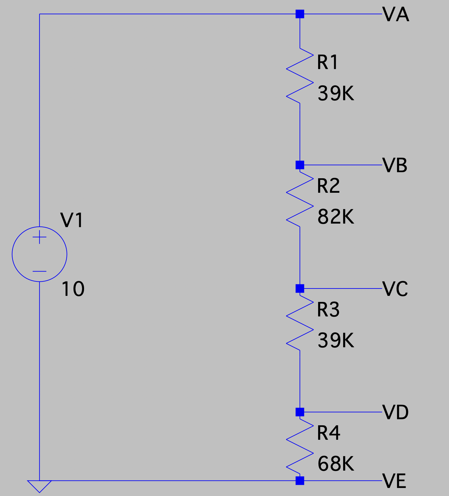
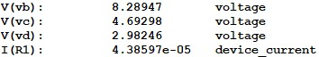
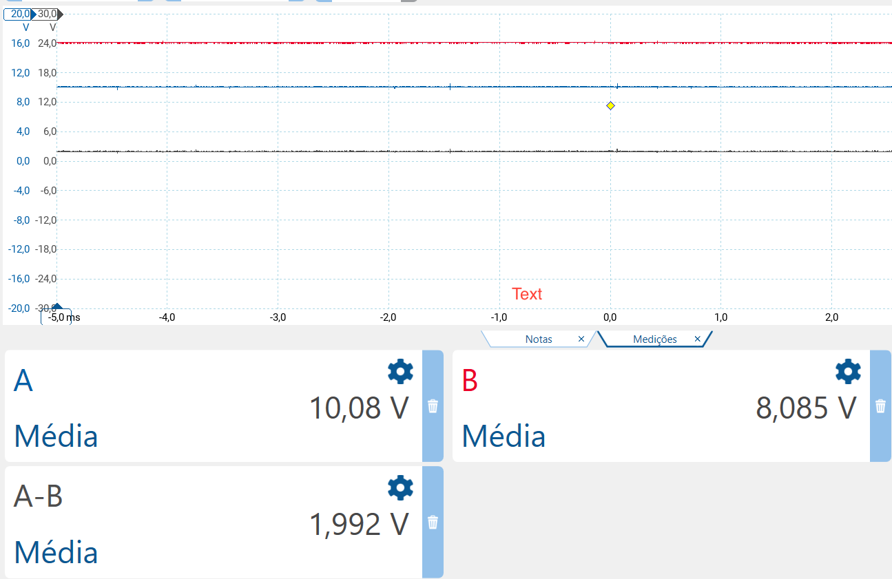
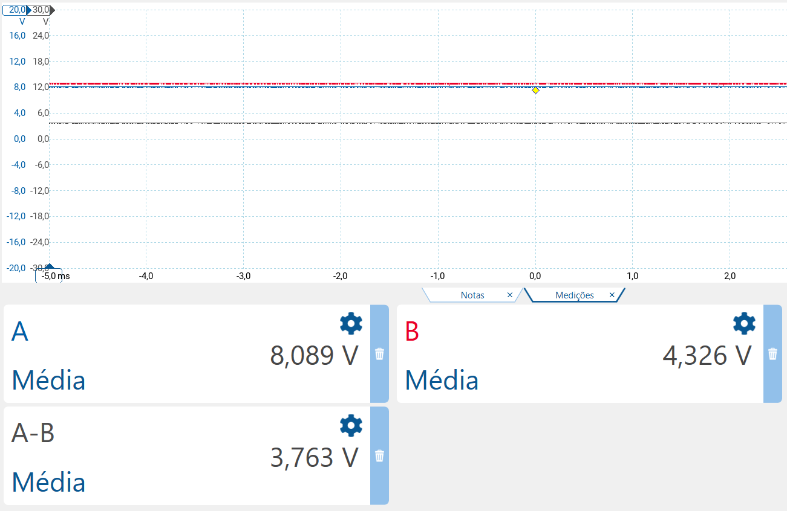
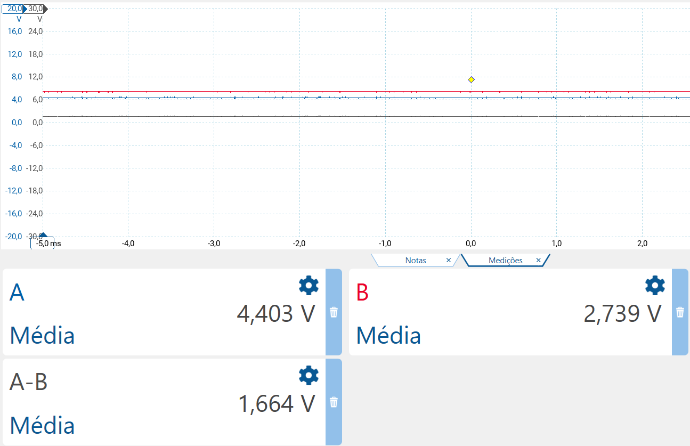

# LAB 1 - DC CIRCUITS

### STUDENTS

Anna Yabe  
Pedro Serrano

## Summary

|Calculation|Simulation|Real values|
|-----------|----------|-----------|
|8.2918V    |8.2895V   |8.085V     |
|4.7002V    |4.6930V   |4.326V     |
|2.9920V    |2.9825V   |2.739V     |

## Calculations

The topic of this lab is voltage dividers. We started using our student numbers for the resistor values and, after getting them, we got the closest E12 resistor values so that we could teste it after. The values we got were:

- R1 = $39\mathsf{k\Omega}$
- R2 = $82\mathsf{k\Omega}$
- R3 = $39\mathsf{k\Omega}$
- R4 = $68\mathsf{k\Omega}$

Using these values and a starting voltage of Vs = 10V we can calculate the voltages at tapping points VB, VC and VD.

First, we add all the resistances:  
$R1 + R2 + R3 + R4 = 39k + 82k + 39k +68k = 228k$

Now, we are able to calculate the current: 
$U = R * I <=> 10 = 228k * I <=> I = 43,9µA$

After calculating the current, we can now calculate the voltage on tapping points VB, VC and VD.

#### Voltage in VB

$U = R * I <=> U = 39k * 43,9µ = 1,7082V$  
$Vs-Vlost=V<=>10-1,7082=8,2918V$

#### Voltage in VC  

$U = R * I  <=>  U = 82k * 43,9µ = 3,5916V$  
$Vs - Vlost = V  <=>  8,2918 - 3,5916 = 4,7002V$

#### Voltage in VD  

$U = R * I  <=>  U = 39k * 43,9µ = 1,7082V$  
$Vs - Vlost = V  <=>  4,7002 - 1,7082 = 2,992V$

## Simulation values

 

As we can see, the values are really close to the ones we calculated.

## Real values

In the next images, we used channel A as the one that measures voltage before the resistor and B the one that measures voltage that goes across the resistor.
A-B represents the voltage that the resistor holds back.  
The values differ a little due to real life constraints that we don't take into account when doing calculations, such as, for example, wire resistance.

### VB

 

### VC

 

### VD

 
