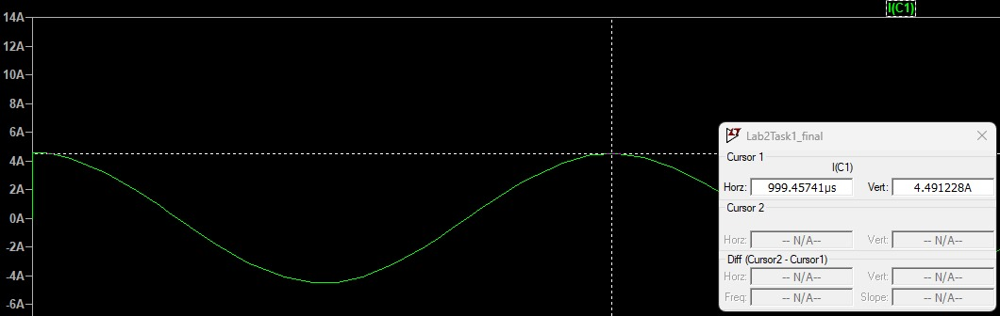

# LAB 1 - DC CIRCUITS

### STUDENTS

Anna Yabe  
Pedro Serrano

## Summary

#### Capacitor

For this task we created a circuit with an AC voltage supply of 7,3V and a capacitor with 100uf using LTspice. By measuring the voltage and current of the capacitor at 3 different frequencies we were able to get the following results:
|Frequency|Voltage|Simulation|
|---------|-------|----------|
|10Hz     |7.3V   |45.86mA   |
|100Hz    |7.3V   |450.73mA  |
|1kHz     |7.3V   |4.5A      |

#### Inductor

For this task we created a circuit with an AC voltage supply of 7,3V and an inductor with 100mH using LTspice. By measuring the voltage and current of the inductor at 3 different frequencies we were able to get the following results:
|Frequency|Voltage|Simulation|
|---------|-------|----------|
|10Hz     |7.3V   |117.68mA  |
|100Hz    |7.3V   |88.70mA   |
|1kHz     |7.3V   |19.09mA   |

## Simulation values

### Capacitor

- Capacitor is a device that can store energy. We can notice that in the Transient simulation there is a 90 degree shift between the voltage and current of the capacitors. Furthermore, they behave like opposites, because when one is going up the other is going down. However, when we change the configurations for AC Analysis the voltage stays constant, while the current of the capacitor grows as a logarithmic function. This exponential grow can explain how capacitors stores energy. For example, once the capacitor has enough charge, it cannot store more charge.

 
 
 

### Inductor

- Inductor, however, have the ability to produce electromotive force. Because of that, when a voltage is applied to the inductor, the current won't start immediately to flow through the inductor, and when the supply stops offering the voltage, it won't be immediately that the inductor will stop the current flowing. Additionally the inductor behaves in different ways with the DC and AC. It presents resistance when the source is alternating current, and that resistance increase with higher frequencies. That's why the graph of current flowing through the capacitor and the inductor look like opposites. When we run the configuration as AC Analysis the graph of voltage is constant, meanwhile the current flowing through the capacitor is reducing exponentially.

 
 
 

## Measuring the RC low pass filter

Let R be 10kohm. Calculate the required capacitor value, which leads to 1.59kHz corner frequency.

From the calculations, we get 15.9nF, so we chose the capacitor with 10nF.

Now, using the formula to calculate the attenuacion (A=20*log(Vout/Vin)), we get to the value of A = 3.385dB.

The difference between the attenuation value we got and the typical attenuation (which is 3dB) can be explained by a couple of reasons. One being that we rounded the capacitance value.
