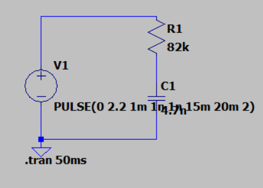
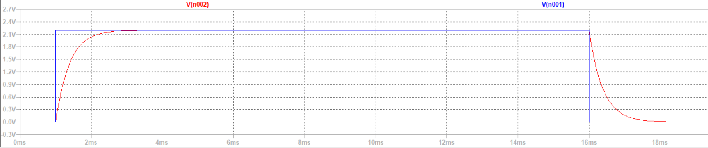
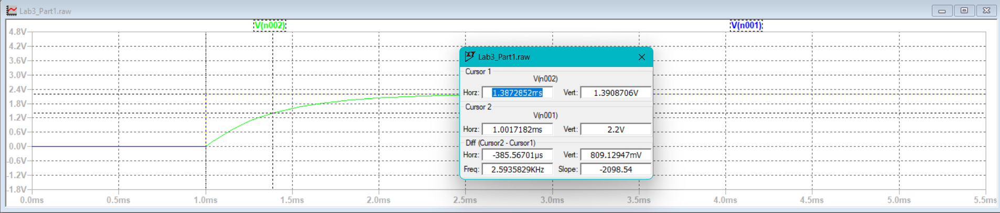
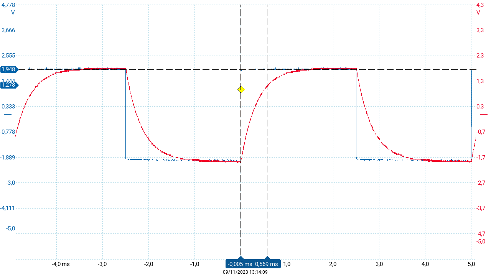
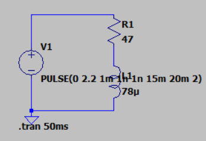
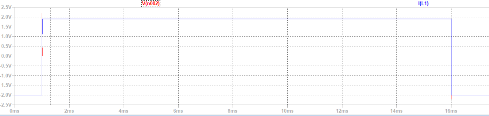
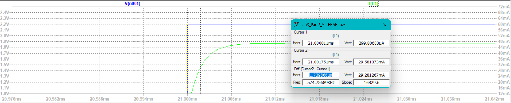

# LAB 3 - Step response of RC and RL circuits

### STUDENTS

Anna Yabe  
Pedro Serrano

## Summary

### Part 1

|Calculation|Simulation|Real values|
|-----------|----------|-----------|
|0,380ms    |0,385ms   |0,583ms    |

### Part 2

|Calculation|Simulation|
|-----------|----------|
|1,66µs     |1,74µs    |

## Part 1 - RC Circuit

For this first part of the assignment we created a RC Circuit with the following description:

- Resistor: 82kΩ
- Capacitor: 4,7nF
- Voltage: 0 to 2,2V

After executing the simulation we got the following plot:

As we can see the Capacitor works as a device that can store current. However, the electronic component has limitations where they cannot absorve more current. Furthermore, due to the step function we can see that when the power source stops providing electric current, the capacitor starts to discharged gradually the current he had stores.

## Calculations

Calculating the half time:

τ = R *C
τ = 82k* 4,7n
τ = 0,380ms

## Simulation values

When we extracted the half-time from the step response we got aproximately 0,385ms as a result. We got this result by measuring the difference between the rising edge to 63% of the maximum voltage. Which almost corresponds with the theoretical value τ=RC.

## Real values

While performing lab measurement we used the PicoScope tool to generate the stimulus signal (step) by the use of a square wave. In the experiment in picoscope we can analyze the half-time which was approximately 0,583ms.

## Part 2 - RL Circuit

For this part of the assignment we created a RL Circuit with the following discriptions:

- Resistor: 47Ω
- Inductor: 78µH
- Voltage: 0 to 2,2V

## Calculations

Calculating the half time:

τ = L / R
τ = 78µ / 47
τ = 1,66µs

## Simulation values

After executing the simulation we got the following plot:

When we extracted the half-time from the step response we got aproximately 1,74µs as a result. We got this result by measuring the difference between the rising edge to 63% of the maximum voltage. Which almost corresponds with the theoretical value τ = L/R.

