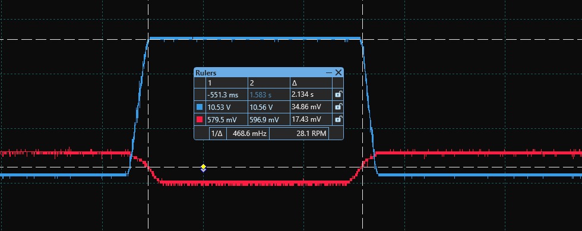

# LAB 4 - Transistor as a Switch

### STUDENTS

Anna Yabe  
Pedro Serrano

## Part 1 - NPN Circuit

For the firt part of this lab we are working with a circuit that has a NPN Transistor. A NPN Transistor is a negative-positive-negative and is controlled by the voltage applied to the base.

 

Here we can see the regions of the transistor. The blue line is the behaviour of the collector.
When we reach around 0.6V at the base, we can see a rise in current at the collector.

Using $Ic=(12V-Vout)/1k$ and $Ib=(Vi-0.65V)/10k$, we get:

At Vout=11.92V, we get the following values for Ic:
|Calculation|Simulation   |
|-----------|-------------|
|80&micro;A |82.97&micro;A|

At Vout=240.4mV, we get the following values for Ic:
|Calculation|Simulation   |
|-----------|-------------|
|11.7596&micro;A |11.7595&micro;A|

At Vi=750.32mV, we get the following values for Ib:
|Calculation|Simulation   |
|-----------|-------------|
|1&micro;A |7.4&micro;A|

 

After the simulation, we proceeded to implement and verify if the simulation met the real behavior of the component. In this case, when we plot the output (blue) and the input (red), we can see that, when the input reaches around 600mV, the output acts like a switch and starts conducting, which was what we were expecting to see.

 

### Real values

## Part 2 - PNP Circuit

The second part of the lab was to repeat the work done in Part 1 but using a PNP transistor in the circuit. A PNP Transistor is a positive-negative-positive and is controlled by the voltage applied to the base.

 

Here we can see the regions of the transistor. The blue line is the behaviour of the collector.
When we reach around 0.6V at the base, we can see a rise in current at the collector. It is flipped since we are working with negative voltages, even tho it has the same behaviour.

Using $Ic=(12V-Vout)/1k$ and $Ib=(Vi-0.65V)/10k$, we get:

At Vi=-11.7V, we get the following values for Ib:
|Calculation|Simulation      |
|------------|---------------|
|-237&micro;A|-298.53&micro;A|

At Vi=-437.17mV, we get the following values for Ib:
|Calculation|Simulation  |
|-------|----------------|
|-12.4mA|-11.6mA         |

At Vi=-612.15mV, we get the following values for Ib:
|Calculation|Simulation   |
|--------------|-------------|
|-1.26&micro;A |-1.13&micro;A|

 

After the simulation, we proceeded to implement and verify if the simulation met the real behavior of the component. In this case, when we plot the output (blue) and the input (red), we can see that, when the input reaches around -600mV, the output acts like a switch and starts conducting, which was what we were expecting to see.
This is the opposite of the NPN since we are using negative voltages in this circuit, making everything the same but flipped to the negative side.

 

## Part 3 - NPN + LED Circuit

For the third part of the lab is required to build a circuit with a NPN bipolar transistor which is able to feed 15mA to a LED.

 

### Calculations

To calculate the value of the resistance to suply a current of 15mA to the LED while providing a source of 12V (not forgeting that the LED has a drop of around 2V), we can use Ohm's law:

U = R * I  
10 = R * 15m  
R = 10 / 15m  
R = 666ohm  

### Real values

By creating the circuit in the Lab we could see its functionality with a LED. We could easily see the cut off region where the LED did not turn on and then the active/linear phase where the more voltage we applied the brigther was the LED, and finally the saturation phase where the LED was turned on and its brightness did not change. 

We measured the currrent passing through the LED by using Ohm's Law. We had a voltage of around 10.5V and 680ohm resistance:  

 

U = R * I  
9,1 = 680 * I  
I = 13mA  

Again, the behaviour is the same as before. We can now see the voltage across the LED, which allows us to calculate the current.

## Part 4 - PNP + LED Circuit

For the fourth part of the lab is required to build a circuit with a PNP bipolar transistor which is able to feed 15mA to a LED.

 

To calculate the value of the resistance to suply a current of 15mA to the LED, while providing a source of 5V (don't forget that the LED has a drop of 2 volts, so we are actually calculating for a voltage of 3V), we can use Ohm's law:

U = R * I  
3 = R * 15mA  
R = 3 / 15mA  
R = 200ohm  

By creating the circuit in the Lab we could see its functionality with a LED. We could easily see the cut off region where the LED did not turn on, and then the active/linear phase where the more voltage we applied the brigther was the LED, and finally the saturation phase where the LED was turned on and its bright did not change. Furthermore, the PNP worked as an opposite to the NPN.

 

We measured the currrent passing through the LED by using Ohm's Law. We had a voltage of 4.5V and 220ohm resistance:  

U = R * I  
4.5 = 220 * I  
I = 19mA  