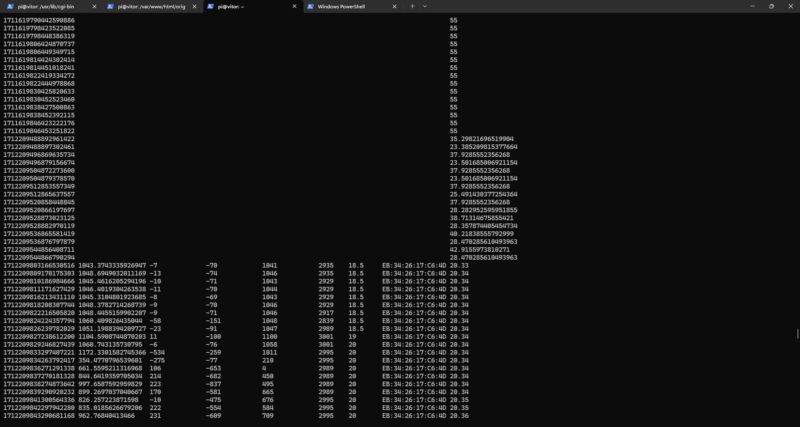

I followed the instructios till the end. Everythign worked perfectly. Below is an image from the last part, where I had the Ruuvi sensor control the state of the led. In this image we can see the sensor variation when I turn it upside down, which changes the led state.

  

This was the setup I did in Nodered. The upper one was used for the first demo and the other one was the one I used to control the LED state.
  

This is the function that checks for the Z acceleration value and changes the led state based on that.
  

In this image we can see the influxdb data. The data above with the single number was provided by the demo project we used and represents the temperature in a division and the data below that shows multiple parameters that come from the Ruuvi tag, including the z acceleration I used to control the LED.
