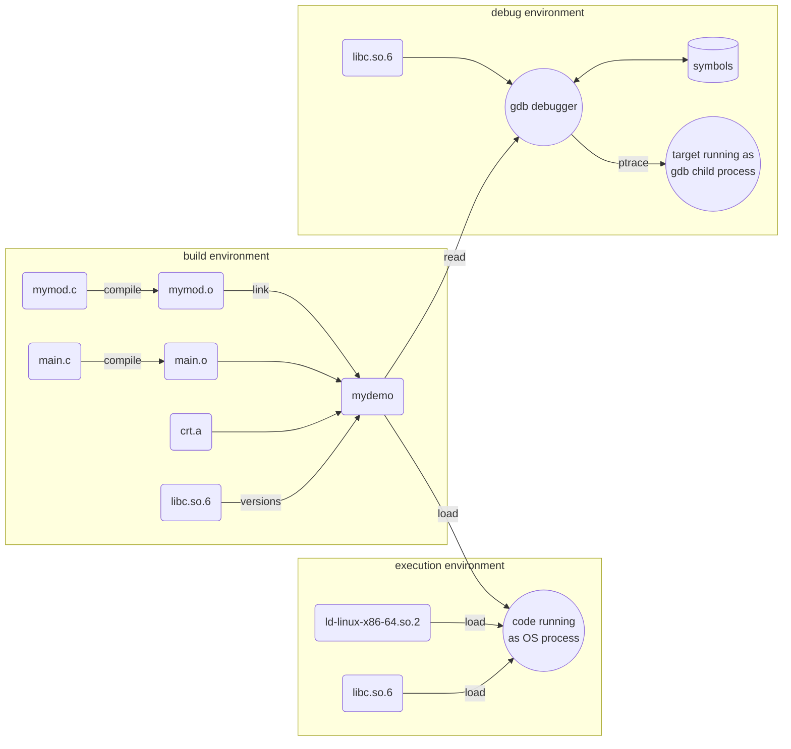
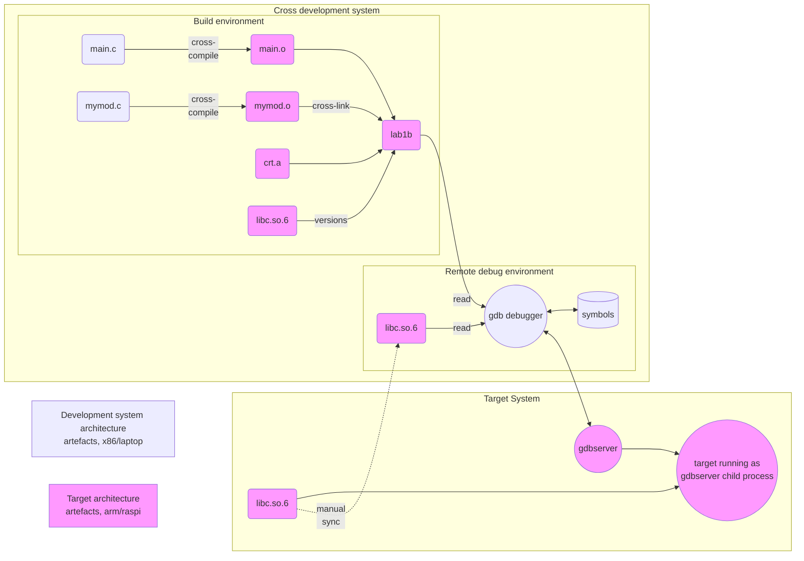

# Cross-Compilation process and libraries


## Key Concepts


| concept | definition
|-----------------|:-------------|
| compiler | Translates source code into machine instructions, outputting an object file. |
| cross-compiler | Translates source code into machine instructions for another (target) architecture |
| architecture | CPU family with specific set of machine instructions, like x86, armv6, mips, ...|
| linker | Merges all object files in project together with necessary static libraries, resulting in executable binary. On command line gcc produces executable a.out by default, that file name is used in some examples below. |
| object file | *.o files: Sequences of compiled machine code that need to be linked to other code to form an executable binary. Object files contain program symbols (for debugging purposes) unless that information has been stripped. | 
| library | An archive of object files (of generally usable compiled program snippets) |
| static library | Link-time option where library code is permanently inserted into final executable. This may result in higher usage on main memory, if the same library has multiple copies in different executables. This also fixes the library version forever (good thing: no future dependency problems, bad thing: library bugs and vulnerabilities will not be fixed automatically with distro upgrades). |
| dynamic library | Link-time option where the link between executable and library is left for loader to be performed at run-time. On Linux systems these are shared objects (.so files), on Windows they are DLL files. | 
| loader | Operation that loads executable binary from mass memory (disk) into main memory (RAM), and loading all necessary shared libraries, and forming a virtual memory map for these. Provided by operating system. |
| GLIBC | GNU collection of C system libraries, the most important of which is libc.so.6 C standard library |
| translation unit | The unit of source code input for the compiler. In C language the compiler processes one C file at a time (with header files that are #included). This means that if your project contains two .c files, then compiler must be invoked two times. |
| gdb | GNU debugger is the most common debug tool for linux systems | 
| debugger | Debugger loads all symbols (variable and function names) from object files and libraries. Debugger can then run the target program (aka debuggee or inferior) as its child process and have full control over the execution of it using ptrace functions and trap (software interrupt) mechanisms, thus enabling breakpoints, single-stepping and inspection of all program variables with symbol names. | 

Sources
[https://opensource.com/article/20/6/linux-libraries]  
[https://eli.thegreenplace.net/2011/01/23/how-debuggers-work-part-1/]  
[https://eli.thegreenplace.net/2011/01/27/how-debuggers-work-part-2-breakpoints]  

## Common Linux command line tools for (cross-)compilation

| cli tool | properties
|-----------------|:-------------|
| file | Can be run on any file to discover what kind of file it is. Try <br>`file main.c`<br>`file a.out` |
| readelf | Information on binary executable and object files. Can show architecture and symbols in file. <br>`readelf --headers a.out`<br>`readelf --symbols a.out`<br>`readelf -d lab2 \| grep NEEDED` shows what library function versions an executable requires | 
| objdump | Information on binary executable and object files. <br>`objdump -T a.out \| grep -F '*UND*'` shows list of required library functions and GLIBC versions for an executable | 
| ldd | Lists dynamically linked (shared) libraries that an executable requires to be loaded for running.<br>`ldd a.out`<br>`ldd --version` #shows running version of GLIBC |
| strings | Extracts constant strings from a binary file. <br>`strings -a a.out \| grep "GCC: ("` shows with which GCC version the executable was built<br>`strings /lib/arm-linux-gnueabihf/libc.so.6 \| grep "GNU"` to find glibc version of libc.so.6 for arbitrary target architecture |
| gcc | GNU C compiler and linker.<br>`gcc main.c`<br>`gcc main.c sub.c -o lab1b` |


## C compilation flow (see graph below)

In this example we assume our project contains two .c source files.
```bash
gcc -g main.c mymod.c -o mydemo
```
1. Each .c file is compiled separately with debug symbols (option -g). Then linker links resulting .o files to C runtime library (which provides entry and exit points for the executable). The resulting executable file has name ´mydemo´.

2. In case of running the code, 
```bash
./mydemo
```
The Linux OS will start the loader, which loads all required shared libraries (can check those with `ldd mydemo`), links them within process virtual memory map, and runs the application.

3. In case of debugging the code, gdb loads the symbols from mydemo (and all referred shared libraries) and user can run the application (or set breakpoints or study variables etc). Normally you would not use gdb directly from command line, but use it integrated to IDE (eclipse or vscode etc). 
```bash
gdb ./mydemo
...
Reading symbols from mydemo...
(gdb) run
Starting program: /home/kali/lab1b/mydemo
[Thread debugging using libthread_db enabled]
Using host libthread_db library "/lib/x86_64-linux-gnu/libthread_db.so.1".
Hello

[Inferior 1 (process 77563) exited normally]
(gdb)
```




Reflection: What are the benefits of shared libraries?

### Cross-compilation flow (see graph below)

In the case of native compilation above, the three environments (build, debug and run) are the same. The shared libraries (libc.so.6 etc) are often exactly the same library for all three usage steps: compilation-time, debugging and run-time. 

Cross-compiled executables cannot be run on development environment (x86 processor does not understand cross-compiled arm instructions; this fact is indicated with color codes in diagram below). So in cross-development environment we need to have our application and all dependent libraries for target system architecture.

Why do we want to use a complex cross-development setup? We could just install and use the compiler on target system? Cross-development setup has the benefit of separating the development and building tasks from the target system limitations: low CPU capacity, small main memory, slow mass memory, no display or limited display resolutions, unreliable hardware, etc. On-target development is possible for small demo programs, but very soon these limitations make working slow and difficult.

In cross-development setup, gdb debugging functionality is divided into two parts. Full gdb runs on development system and more limited gdbserver runs on target system. Gdb handles everything related to symbols and user interface, and gdbserver does only target control parts.

In this setup we end up having multiple instances of the shared libraries:
- Cross-compiler on development system needs a version of target library to check shared symbol names and library versions. Glibc and gcc versions must be in sync for the toolchain. In lab VM we use (cross) gcc 13.2 with glibc 2.27.
- The running code on target system needs access to run-time libraries, and run-time library versions are set by the Linux distro version you are running on target. In lab setup we have Raspbian OS based on debian bookworm, with glibc 2.36. The run-time library version should be same or newer than the build-time library version (Glibc is backwards compatible). 
- Gdb debugger on development system needs to read symbol information from the libraries. These libraries must match target platform libraries. 

Practical consequences (in this lab setup) are indicated by "manual sync" arrow in graph:
- if you `sudo apt update && sudo apt upgrade` packages, you should the same in debugger environment  
- when you `sudo apt install` new packages (including new libraries) to target system, you should install the libraries to debugger environment too:
```bash
pi@rpi0:~ $ sudo apt update
pi@rpi0:~ $ sudo apt upgrade
pi@rpi0:~ $ sudo apt install gpiod

student@student-VirtualBox:~$ sudo sbuild-apt rpi3-bookworm-armhf apt-get update
student@student-VirtualBox:~$ sudo sbuild-apt rpi3-bookworm-armhf apt-get upgrade
student@student-VirtualBox:~$ sudo sbuild-apt rpi3-bookworm-armhf apt-get install gpiod
```




### Lab assignment

Your first task is to study what shared libraries your executable "lab2" requires, and return your findings as text document in your repository `embedded-linux-labs/lab2/libraries.md` (have a quick look at markdown format while doing this, you have examples all around the repository!)
- where is your executable located in VM, and where in raspi is it copied to?
- use `file` command to check for what architecture the executable was built for
- use `ldd` command to find out what shared runtime libraries your executable requires (you need to run this in environment that supports the architecture of previous step!)

Your second task is to identify all C runtime libraries in your development setup (VM and raspi), and return your findings in the same text document in your repository `embedded-linux-labs/lab2/libraries.md`
- Find all files named `libc.so.6` in both systems VM and raspi (use `find` command; use `sudo` to extend the search to all directories, do net search to get command parameters right)
- For each library, collect key information
  - file path
  - library architecture (use `file` as in cli commands above; you may need to follow symlinks) 
  - library version (use `strings` as in cli commands above)
  - (you could skip all paths with `snap`: they are certainly snap packet manager environments completely unrelated to cross-compilation)
- Identify (file path and version) the three libraries in cross-development diagram above:
  - Build-time library (in VM, see note 1 below)
  - Run-time library (in raspi, see note 1 below)
  - Debug library (in VM, see note 2 below)
- libc library is downwards compatible. Can you be sure that executables built on this setup and target Debian Bookworm will run on
  - Debian Bullseye (glibc version 2.31)?
  - Debian Buster (glibc version 2.28)?

**Note 1**: You surely get perplexed with all different paths and library versions. To nail the findings to reality, you can always ask chatGPT to create a C program that prints out both compile-time and run-time glibc versions... for your convenience find the code below, and test it both with native and cross-compilation.
```c
#include <stdio.h>
#include <gnu/libc-version.h>

int main() {
    // Print compile-time version
    printf("Compile-time glibc version: %d.%d\n", __GLIBC__, __GLIBC_MINOR__);

    // Print runtime version
    printf("Runtime glibc version: %s\n", gnu_get_libc_version());

    return 0;
}

```

**Note2**: Once you have started a debug session with GDB (connected to the remote GDB server), you can examine the libraries loaded by the process being debugged. Use the `info sharedlibrary` command in GDB. This will list all shared libraries used by the process, including libc. How to get access to gdb? Start a debugging session and wait for the debugger to stop on first code line, then select "debug console" tab next to terminal tab. There you should see from where the symbols were loaded, and additionally you can use `-exec info sharedlibrary` to list all libraries again.


Reflection: What are the key benefits of cross-development setup?
