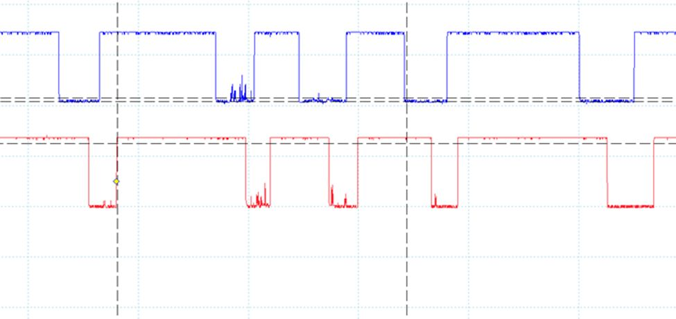
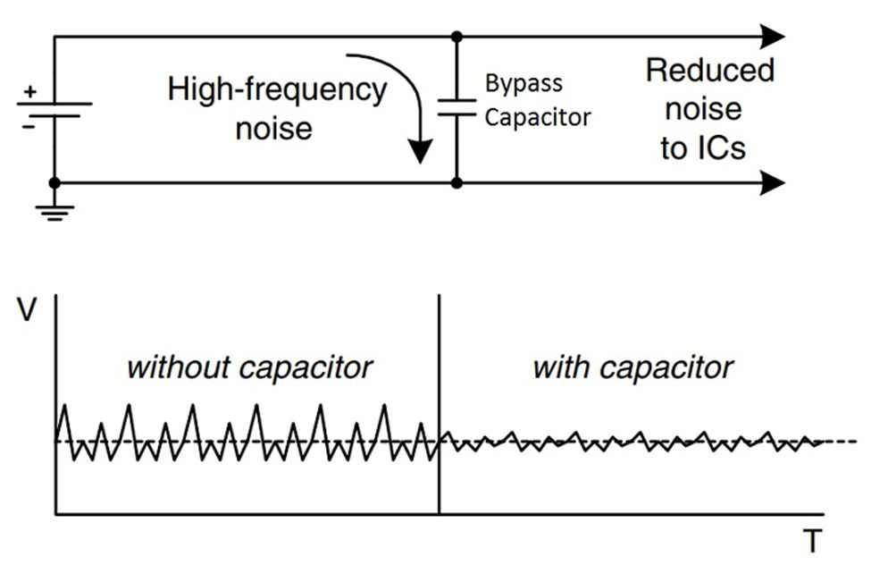
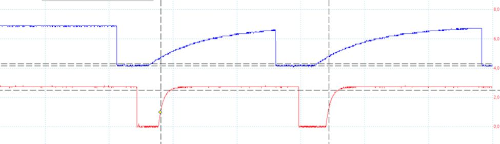
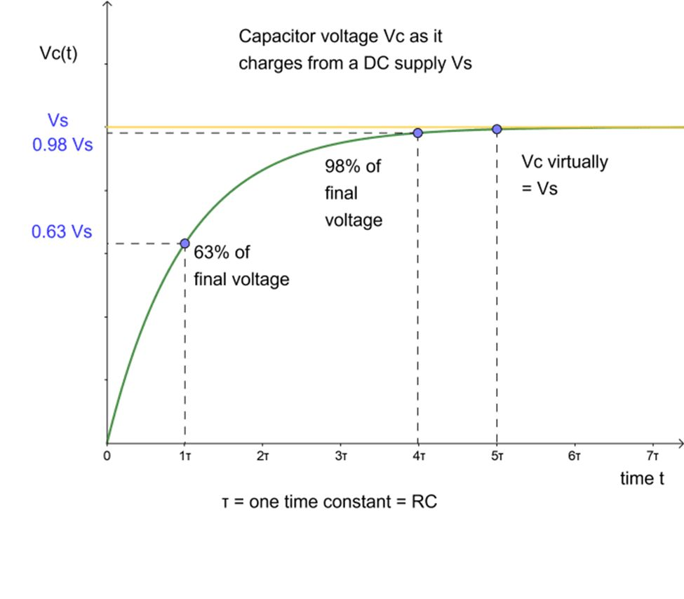

# Filtering noise on signal lines

In case the signals from the rotary encoder are very noisy, like in the figure 1 below, some clean-up is needed.

Figure 1: rotary encoder output without bypass capacitors

This can be done simple by adding capacitors from the signal pins (clock & data) to ground. Remember, capacitor blocks DC, but it lets high frequency AC-components through – so in this case the high frequency AC noise is conducted to ground. This kind of capacitors are called bypass capacitors.

Figure 2: bypass capacitor filtering noise (source: [https://www.electronicshub.org/bypass-capacitor-tutorial/ )](https://www.electronicshub.org/bypass-capacitor-tutorial/%20))

In figure 3 you can see the effect of the bypass capacitors to the signals from rotary encoder: The noise is completely removed. But, you can also see an unwanted side effect – the rise time of the signal is considerably increased. Here the blue signal has 1uF capacitor, whereas the red line has 100nF capacitor.

Figure 3: rotary encoder outputs with bypass capacitors

In the idle state (knob is not turned), both clock and data are high (at VCC) - so the capacitors are charged to VCC. When we turn the knob (to either direction), there is a sequence in clock and data. In effect, the rotary encoder actively pulls down the data and clock lines. The resistance of the switch (transistor) performing this pull-down is rather low, so you have a sharp falling edge on the signals. Once the encoder releases them, the pull-up resistors on the rotary encoder board will start to charge the capacitors again to VCC. Now, the pull-up resistors have quite high resistance value, 10 kohm, so the charge current is limited to maximum 3V/10kohm = 300uA. As the capacitors voltage increases, the voltage difference gets smaller and respectively the charging current is reduced. (Yes! Differential equations are after all used somewhere.) 

This resistance R and capacitance C together form an RC-filter, which has a time constant, 𝜏 (tau), which equals R*C. (Check the units: [R] = [U/I] = V/A, [C] = As/V, so [RC] = s ] ) 

By definition, the step response of an RC-filter: during one tau the signal value (Vc) reaches 63% of its final value.  Mathematically: Vout = Vin*(1-e^(-t/tau)). When t = tau, this becomes Vout ? Vine^(-1) = 1-1/e = 0.63. *The final value is reached in roughly 5 tau.* (Mathematically speaking: it is never reached, but it's getting approaching it, asymptotically). This is illustrated below.

From figure 3 we could see that 1uF capacitor is way too much. If we use rising edge of the clock signal as an event trigger (to poll the value of data line), in this case the data line's time constant is so long that we read logical '0' even if the signal has started transition towards logical '1' before the rising edge of the clock. In this case, the obvious solution is to reduce the size of the bypass capacitor on the data line to 100nF. Another option is to use falling edge of the clock signal as an event trigger.
