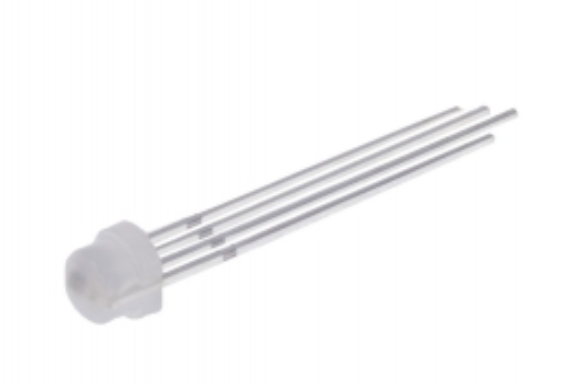

# The Multi-purpose knob

### The specs

In this lab you will combine the pieces developed so far. Your task is to develop a multi-purpose controller with the following functionality: 

- The device has two operating modes (states): a LED dimmer and a servo controller 
    
- The operating mode of the device is selected with a button. The current operating mode is indicated with a (single colour) LED (LED1). 
    
- When the device is in LED dimmer-mode, a rotary switch or a rotary encoder  is used to increase and decrease the intensity (brightness) of the (single colour) LED (LED2). The brightness saturates at 100% when increasing it, and at 0% when decreasing it (in other words, it does not wrap over) 
	- Data sheet of a rotary switch: [SRBM-1371018.pdf](Data_sheets/SRBM-1371018.pdf)
	- Data sheet of a rotary encoder: [Rotary_Encoder.pdf](Data_sheets/Rotary_Encoder.pdf)

- When the device is in servo-control-mode the dimmable LED (LED2) retains its brightness, and the knob controls the servo position instead. Saturation as in LED dimmer mode. 
    

### Things to consider: 

In earlier labs you have already used hardware PWM.  Configure RasPi so that it takes another HW PWM into use (see instructions of lab 4.2 :  [https://blog.oddbit.com/post/2017-09-26-some-notes-on-pwm-on-the-raspb/](https://blog.oddbit.com/post/2017-09-26-some-notes-on-pwm-on-the-raspb/) ). 

The PWM rate (the PWM frequency) for the LED should be high enough – otherwise there will be visible flickering. Experiment with different frequencies. Where is the limit of visible flicker? 

In essence, you need to create an up-down-counter, which is then controlled by the event handlers (up and down events). Also, the "select"-button needs an event handler. To maintain the states of led, servo and mode selection, you might need to use global variables (which are generally ugly).... or static variables inside functions, which are pretty cool. Have a look at this article: [https://www.geeksforgeeks.org/static-variables-in-c/](https://www.geeksforgeeks.org/static-variables-in-c/) 

The rotary switch is "easy to use", but has really bad switch bouncing, which you need to take care of properly. The rotary encoder is slightly more complex to use, but it has an in-built button (press the shaft). You can use either. Even both, if you want. 

The rotary encoder suffers (occasionally) from noise issues, causing very unreliable and indeterministic operation. Long power lines and long signal wires will make noise issues more severe and sometimes it is necessary to solve these issues with hardware. See: 
[Filtering noise on signal lines](lab6/Filtering_noise_on_signal_lines.md) 

## Bonus task (a bit tricky one): 

Replace the single-colour led with a RGB –led. Not just any RGB-led, but this one:  [https://www.triopak.fi/fi/tuote/WS2812D-F5-SH](https://www.triopak.fi/fi/tuote/WS2812D-F5-SH) 

[Data sheet of WS2812D](WS2812D-F5.pdf)

This type of LEDs are extensively used in decorative lighting, like Christmas lights, led strips etc.  

In order to use these, you need to have a driver. The protocol these "addressable" LEDs are using, is based on coding, where '0' and '1' bits are coded with different pulse length. 

Note that there are multiple ways to generate such pulse sequence: 

- Using the SPI driver (Hardware, MOSI only)     
- Using the I2C driver (Hardware, SDA only)     
- Using PWM (Hardware)     
- Bit banging (Plain SW-controlled GPIO-output, loads CPU the most) 
    

Here are some (not directly working) solutions to start with: 

[https://microcontrollerslab.com/ws2812b-rgb-led-pinout-working-interfacing-arduino-applications/](https://microcontrollerslab.com/ws2812b-rgb-led-pinout-working-interfacing-arduino-applications/) 

[https://github.com/qmk/qmk_firmware/blob/master/docs/ws2812_driver.md](https://github.com/qmk/qmk_firmware/blob/master/docs/ws2812_driver.md)

